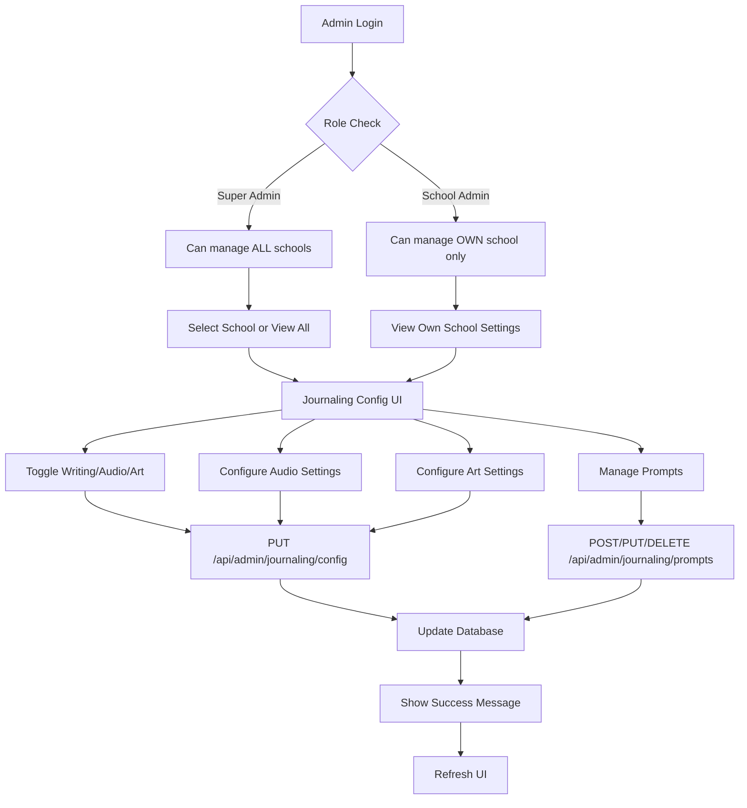
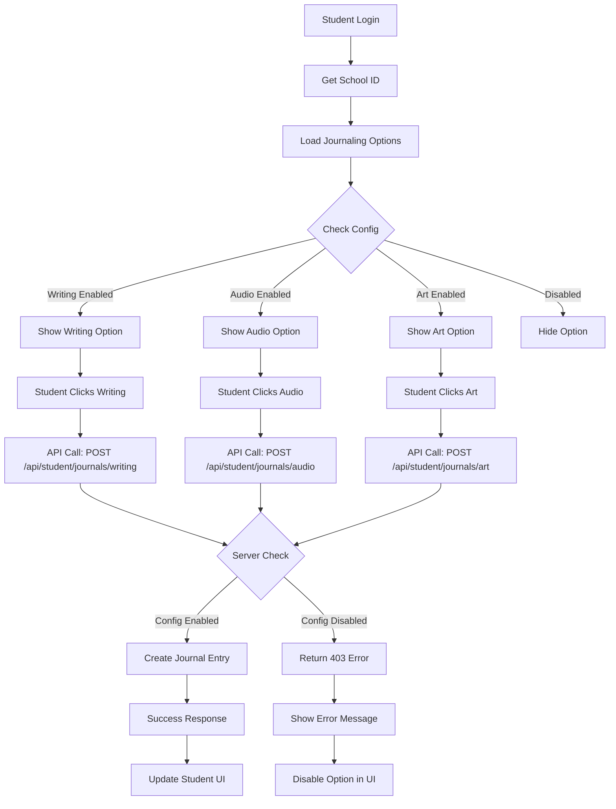
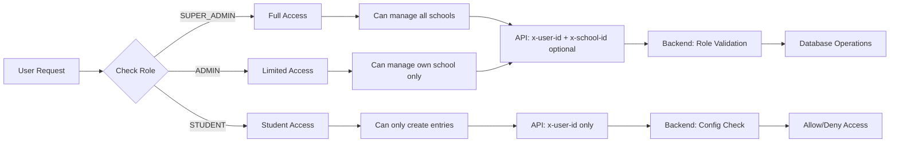
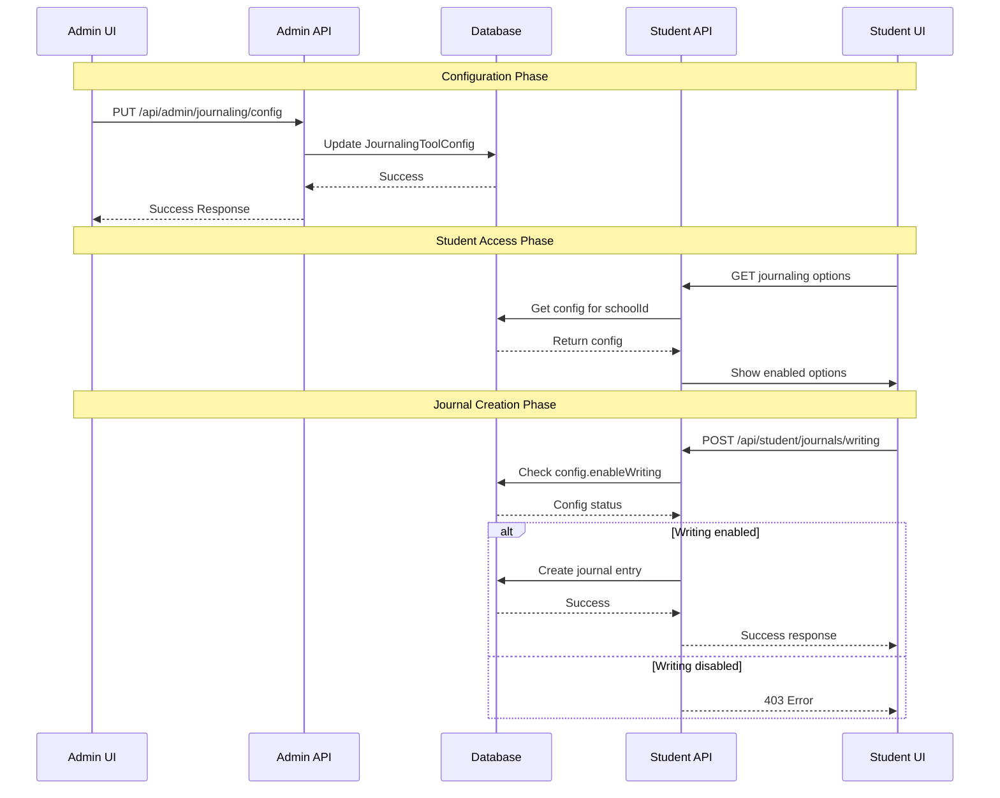
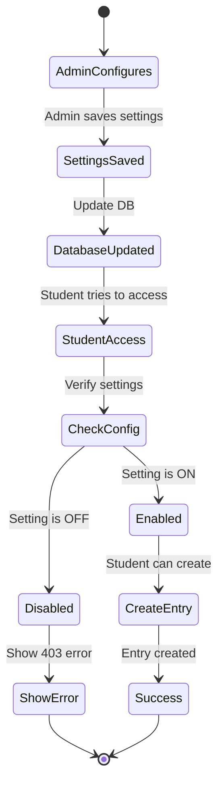
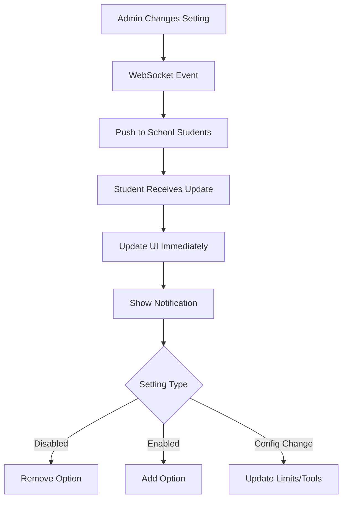

# Journaling Settings Flow Diagram

## 🎯 Admin Configuration Flow

## 👨‍🎓 Student Access Flow

## 🔐 Permission Flow

## 🗄️ Data Flow

## ⚙️ Configuration State Management

## 🎛️ Settings Impact Matrix

| Setting Changed | Admin UI Impact | Student UI Impact | API Impact |
|----------------|-----------------|-------------------|------------|
| `enableWriting` | Toggle switch updates | Writing option appears/disappears | Writing API allows/blocks |
| `enableAudio` | Toggle switch updates | Audio option appears/disappears | Audio API allows/blocks |
| `enableArt` | Toggle switch updates | Art option appears/disappears | Art API allows/blocks |
| `maxAudioDuration` | Dropdown updates | Recording timer limit changes | API validates duration |
| `enableUndo` | Toggle switch updates | Undo button appears/disappears | Canvas tool enabled/disabled |
| `enableRedo` | Toggle switch updates | Redo button appears/disappears | Canvas tool enabled/disabled |
| `enableClearCanvas` | Toggle switch updates | Clear button appears/disappears | Canvas tool enabled/disabled |

## 🔄 Real-time Update Flow (Future)

This flow ensures complete control for admins while providing a seamless experience for students based on their school's configuration.
